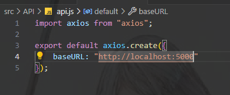
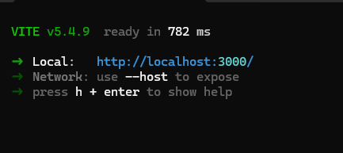
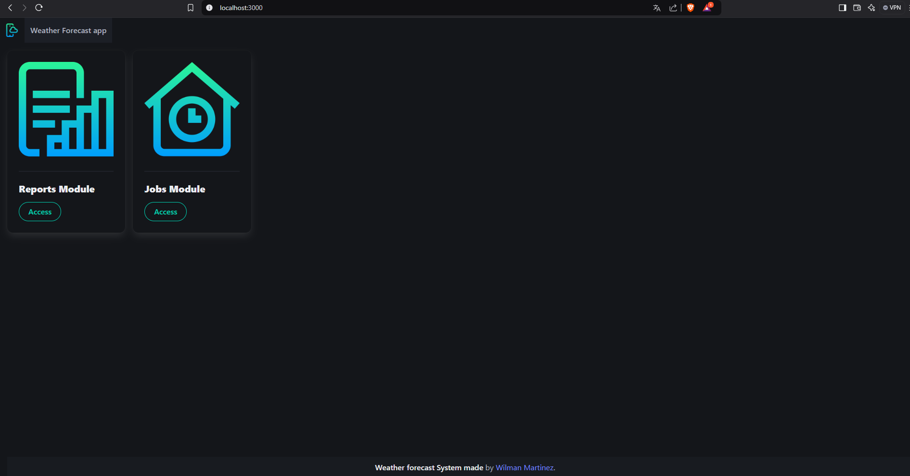
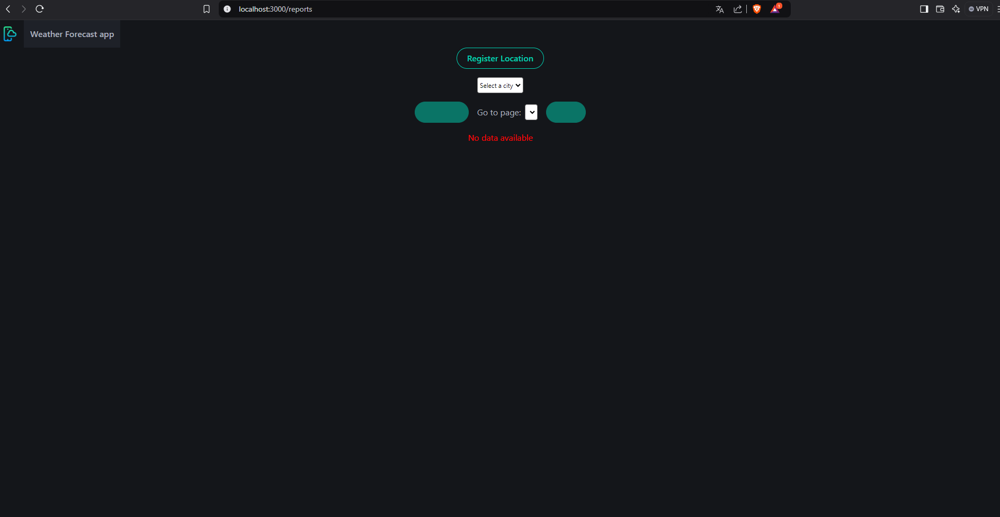
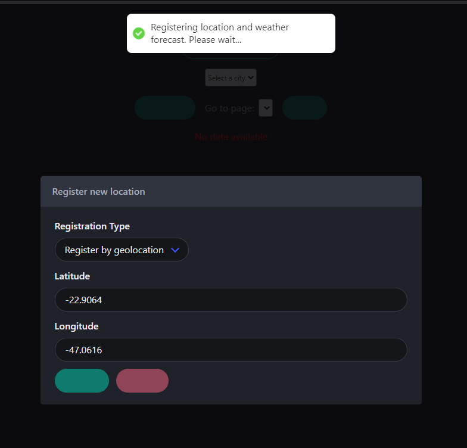
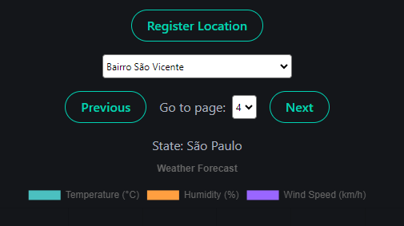
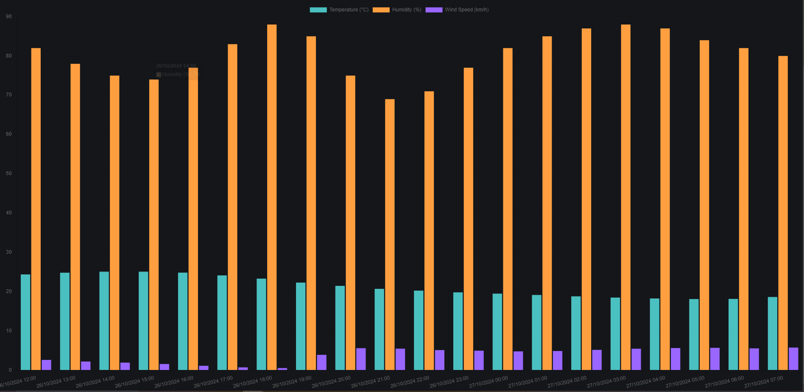
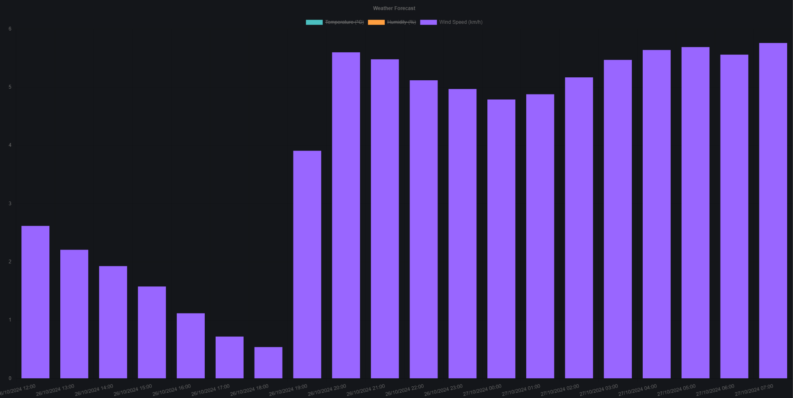

# Weather App Frontend

## Descrição
Aplicação web para exibição de dados de previsão do tempo em diversas localidades através de geolocalização ou por nome de cidade, estado e país.
link para o backend: https://github.com/Will-Martinez/weather-app-backend

## Requisitos para iniciar o backend
- Nodejs (utilizado versão 20.15.1), Vite
- Segue links abaixo para instalação caso necessário:
    - Nodejs: https://nodejs.org/en/download/prebuilt-installer

## Como inciar o frontend
- Abra o terminal no diretório onde foi clonado o projeto e execute o comando "npm install".

- Primeiramente, é necessário ajustar o arquivo de API que fica no diretório src/API/api.js. Dentro dele existe o endpoint do banckend, cujo dependendo
  da porta configurada, será necessário realizar a mudança na string
    

- Após realizar a configuração do arquivo principal de API, o frontend poderá ser iniciado a partir do comando "npm run dev"
    

  copie e cole o endereço http que aparece no terminal e cole no seu navegador para ter acesso a tela de home da aplicação.
    
  
  OBS: O módulo de jobs ainda não possui nenhuma implementação, caso clique em access, nada vai acontecer.

## Funcionalidades da aplicação
 - A funcionalidade principal até então, está no módulo de "Reports Module". Clicando em access será posível ver algumas opções como "Register Location",
   para cadastrar uma nova localização por dados simples(Cidade, Estado, País) ou por geolocalização(latitude e longitude):

    
    OBS: Erro 404 vai aparecer em sua tela caso o banco de dados não tenha nenhuma localização cadastrada.

 - É possível cadastrar uma nova localização, conforme mencionado antes, a partir do clique do botão de "Register Location". Veja as opções
   de cadastro. Lembrando que o cadastro a partir de uma geolocatização, irá cadastrar mais de uma localização, devido ao fato de que a API da MetoBlue
   retorna uma lista de locais que estão enquadrados dentro da geolocalização informada:

   

 - Após realizar o cadastro das localizações, a rotina que roda em background no servidor, fará uma atualização dos dados de previsão do tempo para todas as      localizações cadastradas a cada "N" intervalo de temp(Configurado no backend). Sendo assim, ainda na mesma rota de reports, é possível selecionar a cidade e navegar
 entre a paginação dos resultados de previsão de humidade do ar, temperatura e velocidade do vento em intervalos de uma hora dentro de 7 dias.

   

    
   

 - É possível também escolher quais das opções de previsão do tempo vão aparecer na tela, apenas clicando nas legendas
   
   